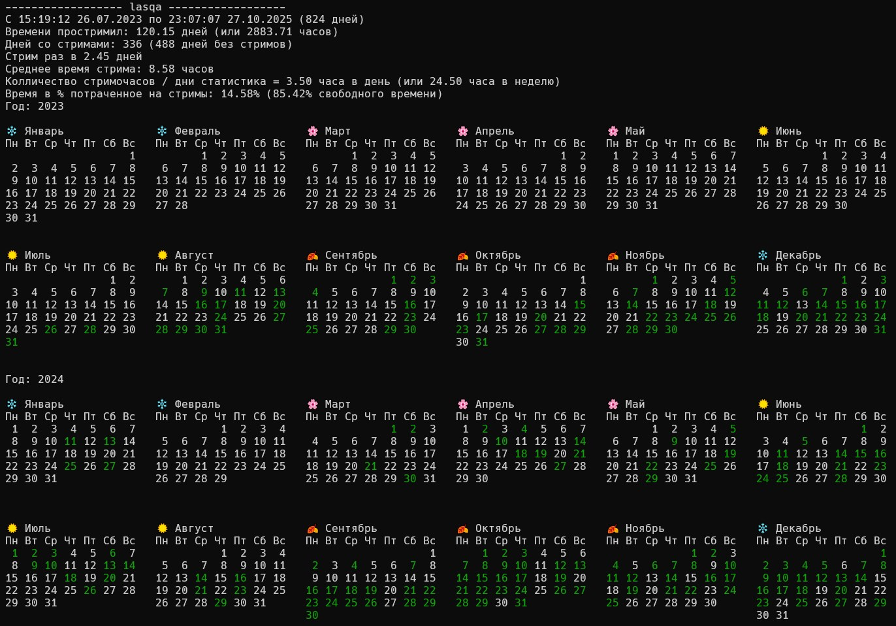

# VK Video Live Stats

A simple Node.js script that fetches streaming statistics from VK Video Live (live.vkvideo.ru) and displays analytics with a visual calendar.

## Features

- Fetches all stream records for a specified user via VK Video Live API
- Calculates comprehensive streaming statistics:
  - Total streaming time (days/hours)
  - Number of streaming days
  - Average stream duration
  - Streaming frequency
  - Time percentage spent streaming
- Displays a yearly calendar with streaming days highlighted in green

## Installation

```bash
npm install
```

## Usage

Edit the `streamer` variable in `index.js` to track a different user:

```javascript
const streamer = 'lasqa'; // Change to desired username
```

Run the script:

```bash
node index.js
```

## Example Output



Followed by visual calendars for each year showing streaming days.

## License

MIT
